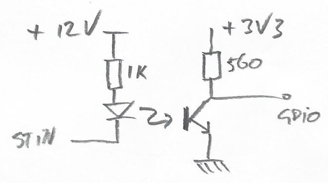
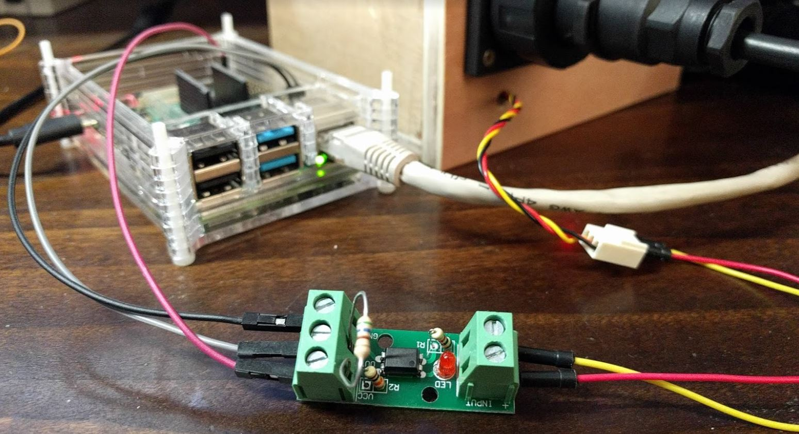
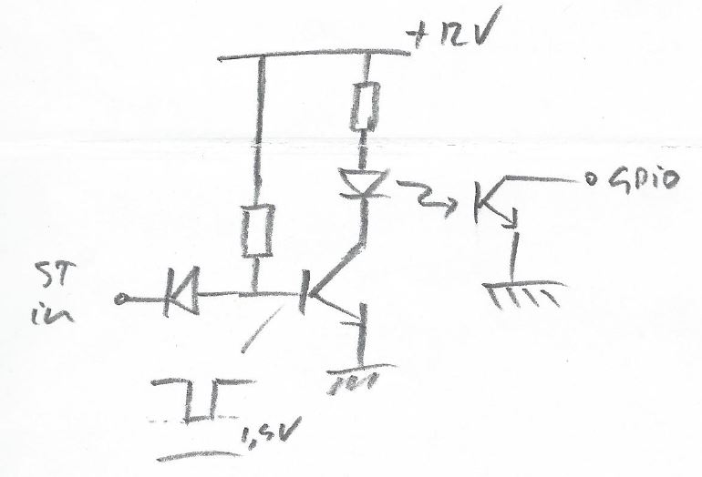
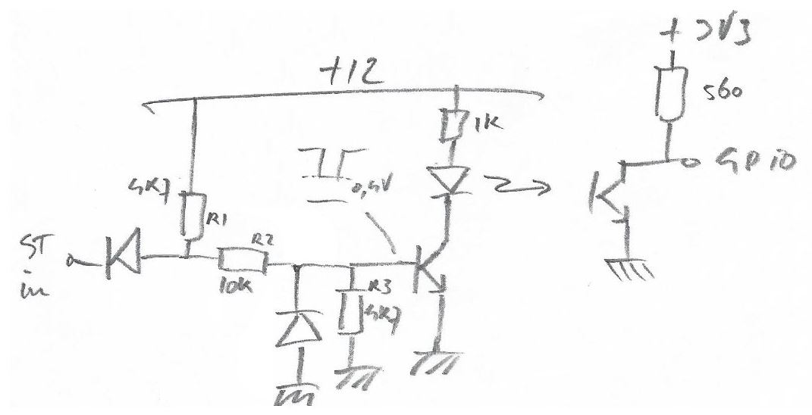
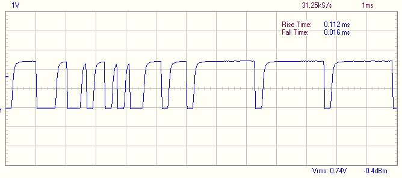
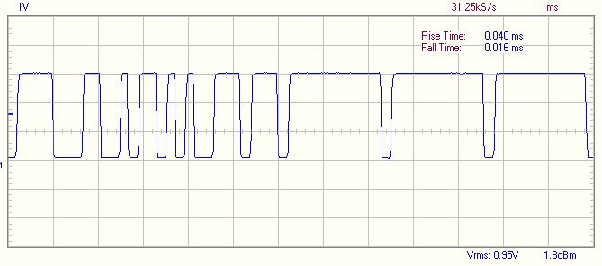
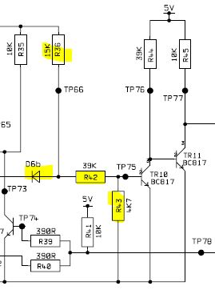

# seatalk_convert
Script that reads 9-bits seatalk 1 messages from any GPIO port using bitbanging, and converts it into NMEA0183 messages.

Based on https://github.com/MatsA/seatalk1-to-NMEA0183

Only a few NMEA sentences are currently created: VHW, HDG, VLW, and MTW.

VHW sentences contain only Speed Through Water. HDG contains Compass Heading. VLW sentences contain trip log and total log.

Water temperature MTW sentences are also created because I could, not because I really use it.

`sudo apt-get update && sudo apt-get install pigpio python-pigpio python3-pigpio`

# Processing the Seatalk 1 signal for the Raspberry Pi
Seatalk 1 is electrically defined as an open collector interface. Multiple senders on the same line are allowed to pull the line low when sending. There is a bit more to it than that, but for reading the signal it is important to realize 2 things:
- that you cannot really draw positive current from the interface; and 
- that senders typically cannot pull the signal lower than 0.7 volts above ground. 

Putting a optocoupler between the seatalk signal and ground, as often recommended, is therefore **not** a good option, and if it works, it parasitizes on the fact that most outputs and inputs on the one-line bus have some form of pull-up resistors. You might risk serious degradation of the signal, only to manifest itself at awkward times. If you want to go this cheap way, better would it be to put the opto-coupler between the 12V and the seatalk line, thereby inverting the signal, but you can deal with that later.

 

Even better would be to process the signal without drawing too much current. The first option I tried was this, and it did not work. The reason why it did not work is that the diode also has a voltage drop of 0.7 volts, and the basis of the transistor would never be pulled below 1.4 volts, thereby making it always remain switched 'on':

The key to this problem was to have a voltage divider before the basis of the transistor. R2 and R3 divide the 1.4 volts left after the first diode to not more than 0.4 volts, which makes the transistor really switch 'off' and leaving no residual 'light' in the opto-coupler. Only then is the Raspberry's software-defined pull-up resistor able to pull the GPIO port up to a clear level (1). The values for R1-R3 appeared to be critical; given values for R2 and R3, R1 could not be too high otherwise the transistor would not go sufficiently open:

Still I found a rise-time of 0.11ms in the signal on the GPIO port.

A 560ohm pull-up resistor to 3.3V lowered this rise-time considerably. Remember Raspberry GPIO port levels are 3V3.
 

Having figured out this all the hard way, the relevant part of Raymarine electrical schema (ST2000+) became immediately clear as well. The voltage divider here consists of R42 and R43. They have different values for the resistors, but they have a two-transistor amplifier.

(1) Note that this applies only for GPIO2 and GPIO3, that have internally 1k8 pull-up resistors. The other GPIO inputs have 50k pull-up resistors, which are not sufficient at all to pull up the line quickly enough at 4800 Baud.
